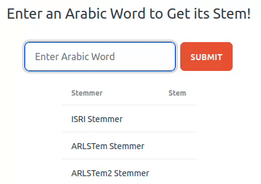

# ArabicStemmer
A simple web app that allows the user to enter an Arabic word and retrieve stem predictions from three of [NLTK's](https://www.nltk.org/) Arabic stemming algorithms.

<p align="center">
  
</p>


This was created as a learning project to learn more about python stemming algorithms for the Arabic language, to experiment with SvelteKit, especially its API functionality, and to explore Node child processes. 
## How To Use

Enter an Arabic word in the prompt. Submitting the request will prompt three of NLTK's Arabic stemming algorithms and deliver the response back in table form to the user.

The user can enter words in two ways:
 - Type the word using an Arabic keyboard
 - Type using the latin script, and use the incorporated [Yamli](https://www.yamli.com/) tool to select the transliterated Arabic

## How It Works

The application simply takes the form entry, calls the python script, and returns the result to the user.

To do this, the web app was scaffolded using [SvelteKit](https://kit.svelte.dev/). 

In this example, Node spawns a [child process](https://nodejs.org/api/child_process.html) to call the python script with NLTK via an API. It takes the form entry as input and returns the predicted stems as output in JSON format. In this way, the script is coupled with the app for a convenient example, but it can also be easily decoupled and hosted elsewhere for standard API function calls. 

## Use the App

In its current basic form, there are a few steps required to get the app up and running. 

  1. Clone the repo from GitHub
```shell
git clone git@github.com:Wollaston/ArabicStemmer.git //using ssh
```
  2. Create a virtual environment for working with the Python component of the app
```python
python3 -m venv venv
```
  3. Install NLTK in the virtual environment
```python
pip install nltk
```
  4. Install the SvelteKit and Node dependencies
```node
npm install
```
  5. Launch the app using local host
```node
npm run dev //will provide a link to the proper port
```

## Why Three Predictions?

During experimentation, it became clear that the existing Arabic stemming algorithms from NLTK are not entirely perfect, especially when trying to accurately identify word roots, although they are generally accurate with standard vocabulary.

Therefore, the algorithm provides three predictions to give the user some choice when assessing the accuracy of the responses.

These algorithms are:
  1. [ISRI Stemmer](https://www.nltk.org/_modules/nltk/stem/isri.html)
  2. [ARLSTem Stemmer](https://www.nltk.org/_modules/nltk/stem/arlstem.html)
  3. [ARLSTem2 Stemmer](https://www.nltk.org/_modules/nltk/stem/arlstem2.html)

## Next Steps
  - Explore additional Arabic stemming algorithms and incorporate accordingly
  - Decouple the Python script from the App for efficient hosting options
  - Create a local desktop app for a standalone client
  - Provide the ability to link stemmed responses to a root-based Arabic dictionary and/or provide examples of words based on that stem and root
  - Add additional tooling and guidance to the App, for example the [Buckwalter Arabic Morphological Analyzer](https://catalog.ldc.upenn.edu/LDC2002L49)
  - Program proper error checking
  - Incorporate stem and root verifiers, and warn the user accordingly if the predicted stem does not match an established Arabic stem or root
    - This may be useful when working with roots that are not three letters, or with hamzated/geminated/assimilated words